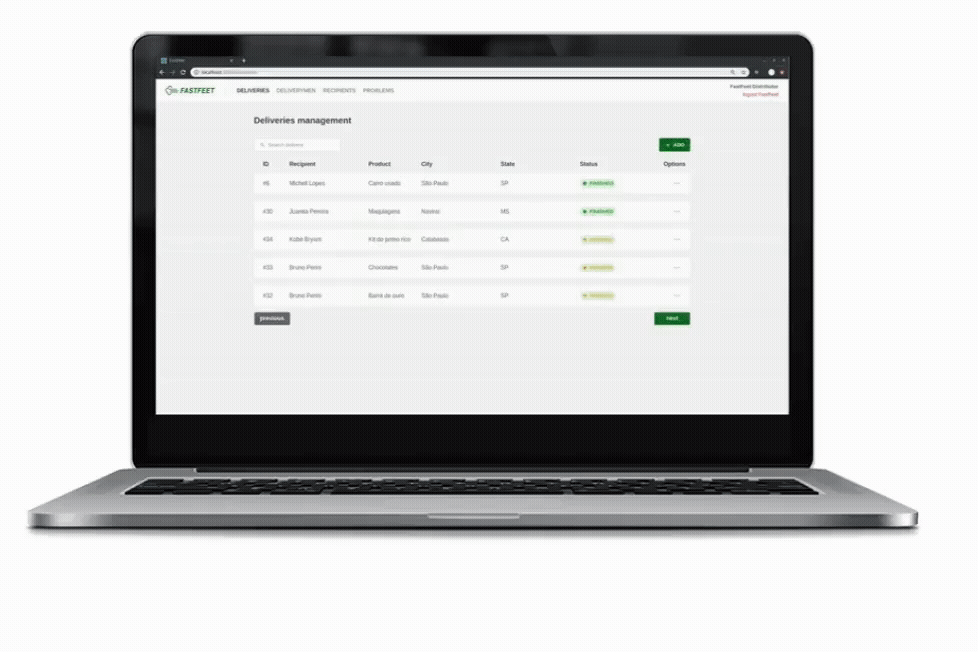
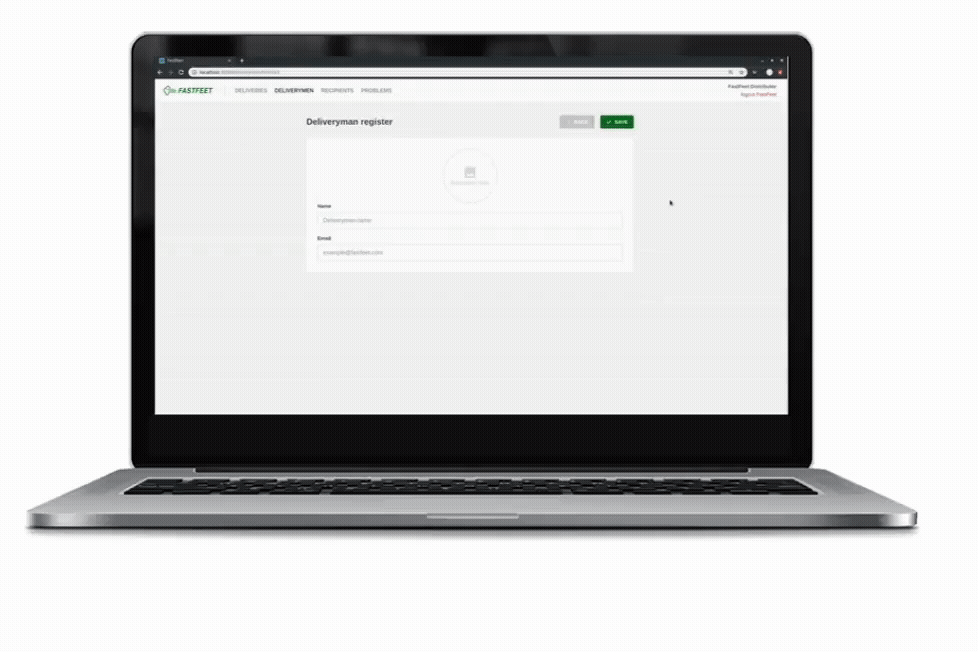

<h1 align="center">
  
   
  FastFeet Web
</h1>

<h3 align="center">
:iphone: Mobile version <a href="https://github.com/gabrielbarth/fastfeet-mobile">here</a>
 
:floppy_disk: Backend version <a href="https://github.com/gabrielbarth/fastfeet-backend"> here</a>
</h3>

 
Mobile aplication that allows delivery management for administrators. It was developed for GoStack10 bootcamp final challange.
 
 
&#x1f1e7;&#x1f1f7;
 
Aplicativo para permitir gestão de encomendas por administradores. Desenvolvido durante o desafio final do bootcamp GoStack10.

## :mag_right: Overview

This application allows:

- List, create, update and remove deliveries and its problems (when registered), deliverymen and recipients;
- Cancel a delivery (through its problem);
- Check delivery status: WITHDRAWAL, FINISH and CANCELED;
- See delivery details, including recipient signature (when FINISHED).

#### :rocket: See about this challange [here](https://github.com/Rocketseat/bootcamp-gostack-desafio-09)

##  :computer: Interfaces view

  
  
  

## :link: Project dependencies

:heavy_check_mark: [**@react-navigation/native (v5)**](https://reactnavigation.org/) `// routing and navigation for your React Native apps`  
:heavy_check_mark: [**unform/web**](https://github.com/Rocketseat/unform) `// rocketseat ::heart:: library that helps you creating beautiful forms`  
:heavy_check_mark: [**axios**](https://github.com/axios/axios)  `// promise based HTTP client for the browser and node.js`  
:heavy_check_mark: [**date-fns**](https://date-fns.org/) `// library to handle with date`  
:heavy_check_mark: [**history**](https://date-fns.org/) `// manage session history anywhere JavaScript runs`  
:heavy_check_mark: [**styled-components**](https://styled-components.com/) `// allows to write actual CSS code to style components`  
:heavy_check_mark: [**redux**](https://redux.js.org/) `// allows manage app global state`  
:heavy_check_mark: [**redux-saga**](https://github.com/redux-saga/redux-saga) `// allows manage app global state using middlewares (each other things)`  
:heavy_check_mark: [**redux-persist**](https://github.com/rt2zz/redux-persist) `// Persist and rehydrate a redux store.`  
:heavy_check_mark: [**reactotron-react-native**](https://github.com/infinitered/reactotron) `// desktop app for inspecting informations through the app`  
:heavy_check_mark: [**prop-types**](https://www.npmjs.com/package/prop-types) `//  used to document the intended types of properties passed to components`  
:heavy_check_mark: [**immer**](https://github.com/immerjs/immer) `//  allows create the next immutable state by mutating the current one`  
:heavy_check_mark: [**polished**](https://polished.js.org) `// a lightweight toolset for writing styles in JavaScript`  
:heavy_check_mark: [**react-native-simple-toast**](https://www.npmjs.com/package/react-native-simple-toast) `// a simple toast for react-native`  
:heavy_check_mark: [**react-native-camera**](https://github.com/react-native-community/react-native-camera) `// allows using camera for react-native`  
:heavy_check_mark: [**react-icons**](https://github.com/react-icons/react-icons) `// icons for react-native`  
:heavy_check_mark: [**yup**](https://github.com/jquense/yup) `// JavaScript schema builder for value parsing and validation`  
:heavy_check_mark: [**react-select**](https://react-select.com/home) `//  flexible and beautiful Select Input control for ReactJS `  
:heavy_check_mark: [**react-toastify**](https://github.com/fkhadra/react-toastify) `//  allows adding notifications to your app with ease `  

**Development dependencies:**  

:heavy_check_mark: [**eslint**](https://eslint.org/) `// allows find and fix problems in your JavaScript code`  
:heavy_check_mark: [**prettier**](https://prettier.io/)  `// sequelize client - ORM for SQL databases`  

## :computer: Getting Started - Running on your machine

These instructions will get you a copy of the project up and running on your local machine for development and testing purposes.

### :ballot_box_with_check: Prerequisites

Check the [backend repository](https://github.com/gabrielbarth/fastfeet-backend) and follow the steps to run this project as well.

### :hammer_and_wrench: Installing

Now follow the bellow steps to run project on your machine:

**1.** Clone this repo using `git clone https://github.com/gabrielbarth/fastfeet-web.git`.  
**2.** Move to the appropriate directory: `cd fastfeet-web`. 
**3.** Run `yarn` to install dependencies. 
**4.** Now consider running the follow commands to ports redirect: `adb reverse tcp:9090 tcp:9090` (for using reactotron) and `adb reverse tcp:3333 tcp:3333`  
**5.** Remember running backend project and databases on docker;
**6.** Run `yarn start` to run the app on your browser `http://localhost:3000/`.  

## :bulb: :handshake: Contributing
Please feel free to contributing and submitting pull requests.

## :pray: Acknowledgments
* Rocketseat team
* Rocketseat community

## :thinking: Any question?
**Contact me on my social medias:** 
[LinkedIn](https://www.linkedin.com/in/gabriel-barth-silv%C3%A9rio-6081ba153/)  
[Instagram](https://instragram.com/gb1.dev)  
[YouTube](https://www.youtube.com/channel/UCmA_19d5L3WTFdDfwQ6Uenw)  
[Discord](https://www.wikihow.com/Add-Friends-on-Discord) (**gabrielbarth1#0492**) 
Or send me an email :incoming_envelope:: gabrielbarth.dev@gmail.com.
 
 
Made with ♥ by [Gabriel Barth](https://gabrielbarth.com)

